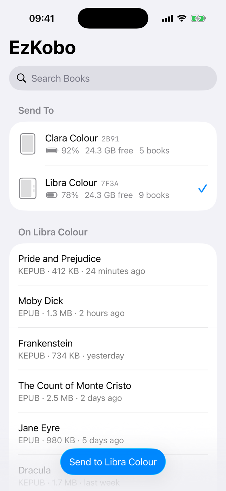
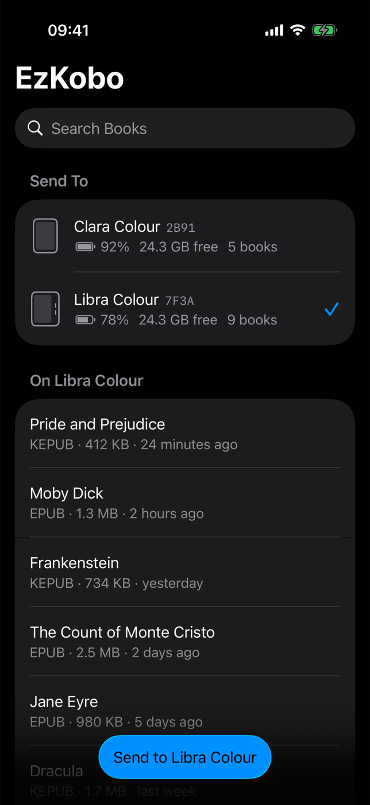
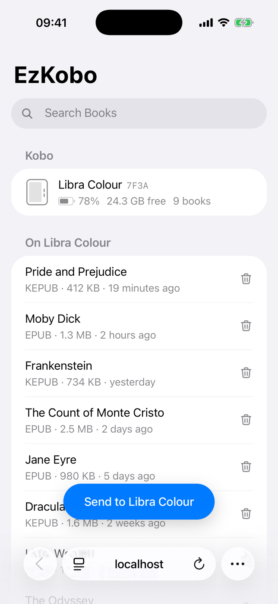
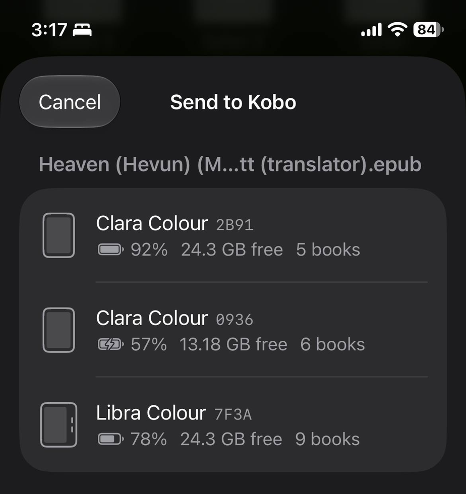
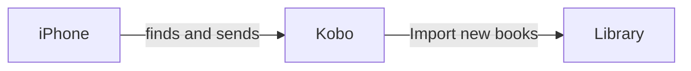

<p align="center">
  
</p>

<h1 align="center">EzKobo</h1>

<p align="center"><b>Send books to your Kobo over Wi‑Fi.</b><br>
Pick a book on your iPhone, tap your Kobo, done. No cable, no cloud, no account.</p>

<p align="center">
  
  &nbsp;
  
  &nbsp;
  
</p>

## Why EzKobo

Getting your own books onto a Kobo usually means a USB cable, Calibre, or
uploading to someone's cloud. EzKobo makes it a two-tap job over the Wi‑Fi you
already have:

- **It just shows up.** Your Kobos appear in the app on their own, like a
  printer on your network. Nothing to pair, no IP addresses.
- **Every Kobo, at a glance.** Model, battery, free space and book count, so
  you pick the right one when there's more than one in the house.
- **Send from anywhere.** From the app, or the Share sheet in Files, Safari,
  Mail and other apps.
- **Books arrive ready to read.** EPUBs are converted to Kobo's own KEPUB
  format, messy titles and authors are cleaned up (missing details and covers
  are looked up online), and files are named "Author - Title".
- **Your library in your pocket.** Browse, search and delete books, with real
  titles, authors and reading progress, and see which books haven't been
  imported yet.
- **Private by design.** Books go phone → your Wi‑Fi → Kobo, never through a
  cloud. The optional details lookup sends only a book's title and author, to
  the sources you pick: Apple Books, Open Library, Google Books or Hardcover.
- **Optional PIN.** Keep others on your Wi‑Fi from seeing or changing your
  books.
- **No app? Use a browser.** Every Kobo also serves the same view at
  `http://kobo-xxxx.local`, for Android phones and laptops.
- **Plays nicely with mods.** Installs alongside NickelMenu, NickelHook mods
  and KOReader, and adds NickelMenu for you if it's missing.

### Send from any app

Share an EPUB, PDF or comic from Files, Safari, Mail or any other app, choose
**EzKobo**, and tap the Kobo to send it to. The one you used last is listed first.

<p align="center"></p>

## How it works



1. **Discovery.** A small agent on the Kobo announces itself on your Wi‑Fi
   (Bonjour / mDNS, service `_ezkobo._tcp`), so the app finds it without
   addresses or pairing.
2. **Transfer.** The app sends the book straight to the Kobo over HTTP. The
   Kobo converts it to KEPUB with [kepubify](https://github.com/pgaskin/kepubify),
   fixes its details if needed, and saves it in the `Books` folder.
3. **Import.** Tap **Import new books** in the Kobo menu, and it appears in
   your library.

The agent is one static Go binary with no other dependencies on the Kobo. It
starts at boot and when Wi‑Fi turns on, does nothing until your phone talks to
it, and is frozen while the Kobo sleeps.

## Requirements

- A Kobo e-reader on firmware 4.x (ARMv7; e.g. Clara, Libra, Sage, Elipsa)
- An iPhone on iOS 26+, and a Mac with Xcode 26+ to build the app
- [Go](https://go.dev) 1.24+ and [XcodeGen](https://github.com/yonaskolb/XcodeGen) (`brew install xcodegen`)

## Install on a Kobo

> [!WARNING]
> EzKobo installs a small program on your Kobo's system storage. It's tested
> on a Clara Colour (firmware 4.45) and designed for ARMv7 Kobos on firmware
> 4.x. Back up your Kobo first (`make install-kobo` does it for you) and use
> it at your own risk.

### Download (no tools needed)

1. From the [latest release](https://github.com/phoenixatom/ezkobo/releases/latest),
   download **`KoboRoot-with-NickelMenu.tgz`** if your Kobo doesn't have
   [NickelMenu](https://pgaskin.net/NickelMenu/) yet, otherwise
   **`KoboRoot.tgz`**.
2. Connect the Kobo to your computer and copy your whole Kobo drive somewhere
   as a backup (include the hidden `.kobo` folder).
3. Rename the download to `KoboRoot.tgz` if needed, copy it into the hidden
   `.kobo` folder on the Kobo (⌘⇧. shows hidden folders on a Mac), and eject.
   If a `KoboRoot.tgz` is already there, another update is waiting: restart
   the Kobo first.

The Kobo installs EzKobo and restarts.

### From source (Mac)

Plug the Kobo in, tap **Connect** on the Kobo (close KOReader first), and run:

```sh
make install-kobo
```

This backs the Kobo up to `~/Kobo Backups/`, copies the right package into its
`.kobo` folder (adding NickelMenu if it's missing), and ejects it. Unplug it:
the Kobo installs EzKobo and restarts. With several Kobos plugged in, it
installs on each.

NickelMenu provides the **Import new books** menu item that gets sent books
into the library. It doesn't support firmware 5.x yet; there, install EzKobo
alone: books still arrive, but importing them needs a USB connection.

**Remove:** `make uninstall-kobo` (or create a folder named `ezkobo-uninstall`
at the top of the Kobo drive), eject, and restart the Kobo.

## Install the iPhone app

```sh
make app                      # generates ios/EzKobo.xcodeproj
open ios/EzKobo.xcodeproj
```

Choose your team under Signing & Capabilities for the **EzKobo** and
**ShareExtension** targets, or put your Apple team ID in `ios/Team.local`
(git-ignored) before `make app`. If the bundle ID is taken, change
`dev.ezkobo.app` in `ios/project.yml`. Run on your iPhone and allow **Local
Network** access.

## Use

1. Turn on Wi‑Fi on the Kobo.
2. In EzKobo, pick a Kobo, tap **Send to …**, and choose books — or share a
   file to **EzKobo** from any app.
3. On the Kobo, open the menu and tap **Import new books**.

Formats: EPUB, KEPUB, PDF, MOBI, CBZ, CBR, TXT, HTML, RTF and images.

### Settings

Tap the gear in the app to change these for the selected Kobo. They're stored
on the Kobo, so they also apply to the Share sheet and the browser page.

| Setting | Default | What it does |
|---|---|---|
| Convert to KEPUB | On | Converts EPUBs to Kobo's KEPUB format |
| Fix Missing Details | On | When a book's title or author is missing or messy (or it has no cover), looks it up online. Sends the title and author to the sources below |
| Details Sources | Apple Books, Open Library, Google Books | Which services to ask, in what order (drag to reorder). Google Books works best with your own API key; Hardcover needs a token |
| Rename as Author – Title | On | Names files "Author - Title.kepub.epub" |
| PIN | Off | Requires a 4–8 digit PIN to see, send or delete books |

With [NickelDBus](https://github.com/shermp/NickelDBus) 0.2.0 installed,
step 3 happens by itself: the book appears in the library as soon as it
arrives. Confirmed on a Clara Colour (firmware 4.45).

## Compatibility with other mods

EzKobo adds four files and changes nothing else:

| File | Purpose |
|---|---|
| `/usr/local/ezkobo/ezkobo` | The agent |
| `/usr/local/ezkobo/boot.sh` | Starts it; handles uninstall |
| `/etc/udev/rules.d/99-ezkobo.rules` | Runs `boot.sh` at boot and when Wi‑Fi turns on |
| `.adds/nm/ezkobo` | NickelMenu items: *EzKobo status*, *Import new books* |

It has been used alongside NickelMenu, NickelHook mods (NickelClock,
NickelHome, …) and KOReader. `make install-kobo` refuses to overwrite
another update waiting in `.kobo/KoboRoot.tgz`. EzKobo needs port 80 on the
Kobo.

## Troubleshooting

- **Kobo not found:** it must be awake with Wi‑Fi on, on the same network.
  Kobo turns Wi‑Fi off when idle; `ForceWifiOn=true` under
  `[DeveloperSettings]` in `.kobo/Kobo/Kobo eReader.conf` keeps it on (uses
  more battery).
- **Log:** `.adds/ezkobo/ezkobo.log` on the Kobo drive (size-capped).
- **Kobo doesn't show up over USB:** close KOReader first; it handles USB
  itself.

## Security

By default anyone on the same Wi‑Fi can list, send and delete books while
the Kobo's Wi‑Fi is on. That's usually fine at home. On shared networks, set a
PIN (gear › PIN). After five wrong PINs, the Kobo refuses tries for 30
seconds. Forgot it? **EzKobo status** in the Kobo's menu shows it, and **EzKobo
remove PIN** clears it.

## Development

```sh
make test     # Go tests
make dev      # run the agent on your Mac as a fake Kobo; the Simulator finds it
make kobo     # build dist/KoboRoot.tgz and dist/KoboRoot-with-NickelMenu.tgz
make backup   # back up every plugged-in Kobo
```

Pretend to be a specific Kobo:

```sh
go run ./cmd/ezkobo serve -addr :8081 -dir tmp/libra -state tmp/libra-state -rescan off \
  -model "Libra Colour" -name "Libra Colour 7F3A" -host kobo-7f3a
```

| Path | What |
|---|---|
| `cmd/ezkobo/` | The agent: command line, HTTP API, settings and PIN, browser page (`web/`) |
| `internal/mdns/` | mDNS / DNS‑SD responder advertising `_ezkobo._tcp` |
| `internal/kobo/` | Kobo model, serial, battery, storage, library database (read-only) |
| `internal/book/` | KEPUB conversion, metadata clean-up and lookup, file names |
| `kobo/` | Boot script and udev rule |
| `scripts/` | Install, backup, packaging, app icon |
| `ios/` | iPhone app, Share extension, shared code |

## License

[MIT](LICENSE). Bundled third-party software: see
[THIRD_PARTY_NOTICES.md](THIRD_PARTY_NOTICES.md).

EzKobo is an independent project, not affiliated with or endorsed by Rakuten
Kobo Inc. "Kobo" is a trademark of its owner.
